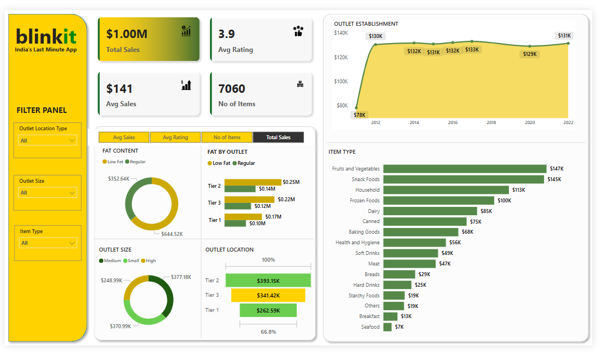

# 🛒 Blinkit Sales Analysis 📊

A comprehensive sales analysis project using **Power BI**, **SQL**, and **Python** on Blinkit (an Indian quick-commerce platform) data. This project aims to extract business insights, identify patterns, and improve decision-making through data visualization and analysis.

---

## 📌 Objective

To analyze the sales performance of Blinkit using real-world data and uncover actionable insights on revenue, top-selling items, customer behavior, and more.

---

## 🛠️ Tools & Technologies

- **SQL** – For data extraction and transformation (ETL).
- **Power BI** – For creating interactive dashboards and data visualizations.
- **Python (Pandas, Matplotlib, Seaborn)** – For data cleaning, EDA (Exploratory Data Analysis), and preprocessing.
- **Jupyter Notebook** – For documenting the data analysis process.

---
## Dashboard Screenshot


## 📂 Project Structure

```plaintext
Blinkit-Sales-Analysis/
│
├── data/
│   └── blinkit_sales.csv
│
├── sql/
│   └── queries.sql
│
├── notebook/
│   └── Blinkit_Analysis_in_Python.ipynb
│
├── dashboard/
│   └── Blinkit_PowerBI_Dashboard.pbix
│   └── Blinkit_Dashboard.png
│
├── README.md
└── Blinkit_Analysis_Presentation.ppt

--
